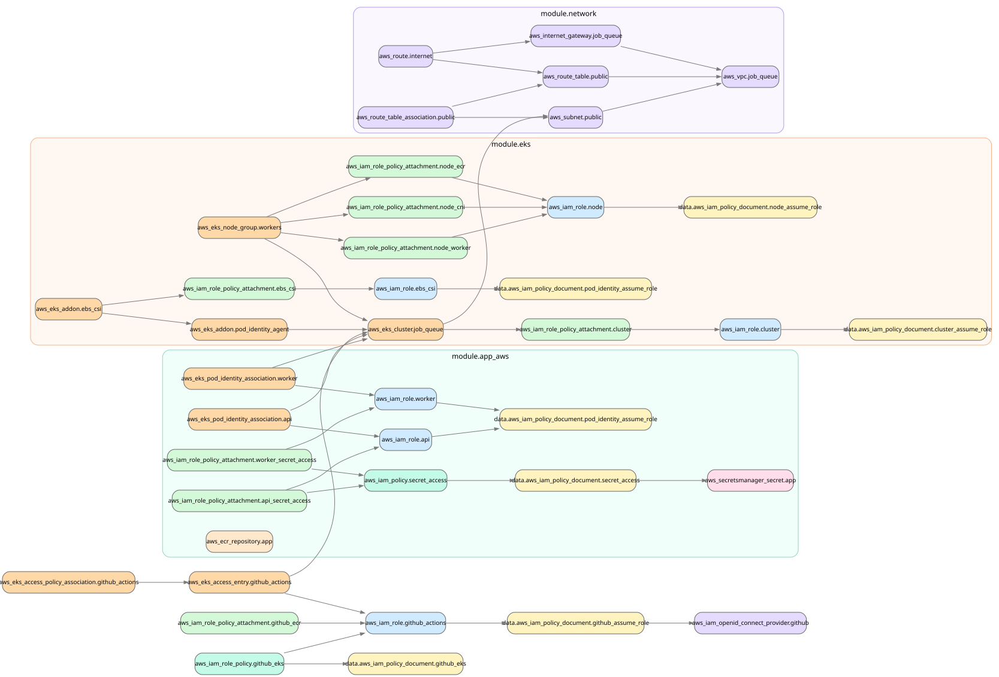

# Terraform AWS infrastructure

Terraform provisions the AWS infrastructure required for this project on Amazon EKS. The configuration is split into small modules for networking, EKS and application-specific AWS resources.

## Infrastructure overview
##### Terraform resource graph
The graph below was generated from the Terraform configuration and shows the main resources and their dependencies.

The infrastructure is divided into three main modules:

- `network` - VPC, public subnets, routing and Internet Gateway.
- `eks` - EKS cluster, managed worker nodes, IAM roles and EKS add-ons.
- `app_aws` - ECR, Secrets Manager and Pod Identity resources used by the application.

## Network
##### VPC and public subnets
The project uses a dedicated VPC with two public subnets in different Availability Zones. An Internet Gateway provides Internet access.

A more isolated setup could use private subnets and a NAT Gateway, so worker nodes would only need private IP addresses.

I was using AWS Free Tier, so I avoided the extra cost of a NAT Gateway. This kept the setup simpler and cheaper, but made the workloads less isolated from the Internet.

## Amazon EKS
##### Cluster, worker nodes and add-ons
Terraform creates the EKS cluster, a managed node group and the IAM roles required by the control plane, worker nodes and selected add-ons.

EKS also installs several standard add-ons automatically, while the project explicitly manages the AWS integrations that were needed for the application:

- **CoreDNS** `[default]` - provides DNS resolution inside the Kubernetes cluster.
- **kube-proxy** `[default]` - handles Kubernetes Service networking on the nodes.
- **Amazon VPC CNI** `[default]` - connects Pods to the AWS VPC network.
- **EKS Pod Identity Agent** `[Terraform]` - allows Kubernetes workloads to use AWS IAM roles through EKS Pod Identity.
- **Amazon EBS CSI Driver** `[Terraform]` - dynamically provisions persistent storage using Amazon EBS volumes

Other cluster-wide components such as KEDA, Envoy Gateway and the Secrets Store CSI integration are installed with Helm and kept outside the Terraform infrastructure.

## Application AWS resources
##### ECR, Secrets Manager and Pod Identity
Terraform creates the ECR repository used by `api-deployment` and `worker-deployment`, together with the Secrets Manager secret used for application credentials.

API and worker use separate IAM roles and separate EKS Pod Identity associations, while both roles are limited to accessing the application secret.

The Secrets Manager resource is created by Terraform, but the actual credentials were entered manually in the AWS Secrets Manager console so they would not be stored in the Terraform state.

## AWS access and Terraform state
##### OIDC without permanent AWS credentials
GitHub Actions authenticates to AWS through an IAM OIDC provider and a dedicated IAM role. This allows the workflows to receive temporary AWS credentials instead of storing permanent AWS access keys in GitHub.

The role can push images to ECR and access the EKS cluster through an EKS Access Entry. The deployment process itself is documented in `k8s/eks/README.md` and `.github/workflows/cd.yml`.

##### Remote state and locking
Terraform state is stored remotely in an S3 bucket, with S3 state locking enabled through `use_lockfile` to prevent concurrent Terraform operations from modifying the state at the same time.

## Design decisions and problems encountered
##### Practical lessons from the infrastructure
- **Public worker networking** - public subnets kept the AWS networking simple and avoided adding NAT infrastructure that was not important for the goals of this project.
- **EBS and Availability Zones** - during testing, I manually removed a worker node to observe how the cluster would recover. The new PostgreSQL Pod was then scheduled in a different Availability Zone than its existing EBS PersistentVolume, so the volume could not be attached. This made the AZ limitation of EBS volumes very clear in practice.
- **Separate workload identities** - API and worker keep separate IAM roles and Pod Identity associations instead of sharing one role, even though both currently access the same secret.
- **Repository structure** - For simplicity, this project keeps reusable Terraform modules and the live infrastructure configuration in the same repository. In a larger setup, these could be separated into a modules repository and a live infrastructure repository.
